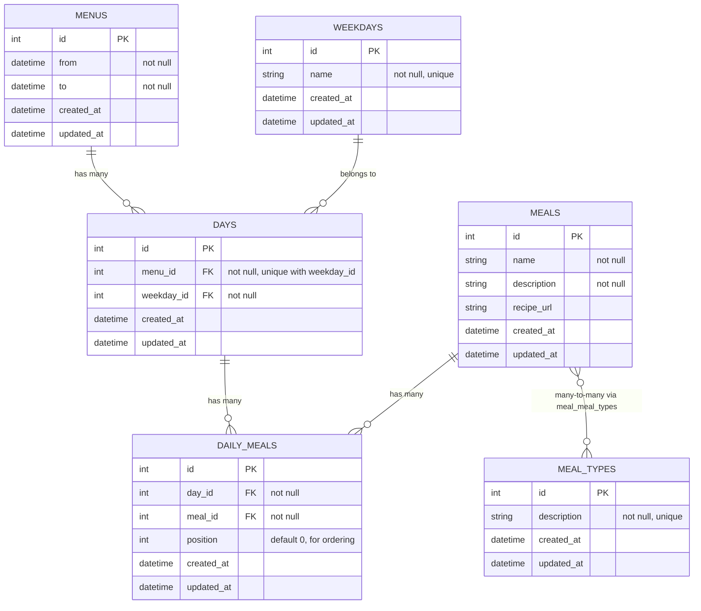

# Meal Planner API

Rails 6 API-only backend for a meal planner: manage menus (weekly plans), days per menu, and meals (with types like breakfast, lunch, dinner). No frontend; intended to be used by a client (e.g. web or mobile app).

**Stack:** Ruby 3.0, Rails 6, SQLite, Puma.

> We use SQLite because we're lazy to install a real DB for this project. Swap for PostgreSQL/MySQL when it matters.

---

## Requirements

- **Ruby 3.0.0** ([.ruby-version](.ruby-version) / [Gemfile](Gemfile))
- **Bundler** (`gem install bundler`)

---

## Install and run

```bash
# Install gems
bundle install

# Create DB, load schema, run migrations
rails db:create db:migrate

# (Optional) Seed weekdays, meal types, and sample data
rails db:seed

# Start the server (default port 3000)
rails server
```

API base URL: **http://localhost:3000**

---

## Tests

```bash
bundle exec rails test
```

(Uses the test database; no extra config needed for the default SQLite setup.)

---

## API overview

| Resource    | Endpoints | Notes                          |
|------------|-----------|---------------------------------|
| `meals`    | CRUD      | List, show, create, update, destroy |
| `menus`    | index, show | Read-only for now              |
| `days`     | create only | Needs `menu_id`, `weekday_id`, optional `meal_ids[]` |
| `meal_types` | index    | For dropdowns (breakfast, lunch, dinner) |

Example: `GET /meals`, `POST /days` with JSON body `{ "menu_id": 1, "weekday_id": 1, "meal_ids": [1, 2] }`.

---

## Database and relationships

Menus have a date range and many days; each day is one weekday in that menu and has many meals (through the `daily_meals` join). Meals are reusable and can have multiple meal types (e.g. avena at breakfast or dinner). Classified Mexican-style: lunch = main meal, dinner = lighter.



**Summary:**

- **Menu** → has many **Day** (one per weekday per menu).
- **Day** → belongs to **Menu** and **Weekday**; has many **Meal** through **DailyMeal** (with `position` for order).
- **Meal** → has many **MealType** through **MealMealType** (a meal can be breakfast, lunch, dinner, or more than one); can appear on many days via **DailyMeal**.

---

## CORS

CORS is configured in [config/initializers/cors.rb](config/initializers/cors.rb). Adjust `origins` there if your client runs on a different host or port.
